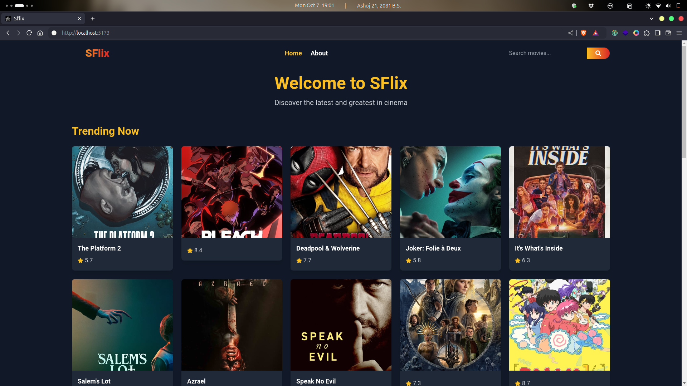
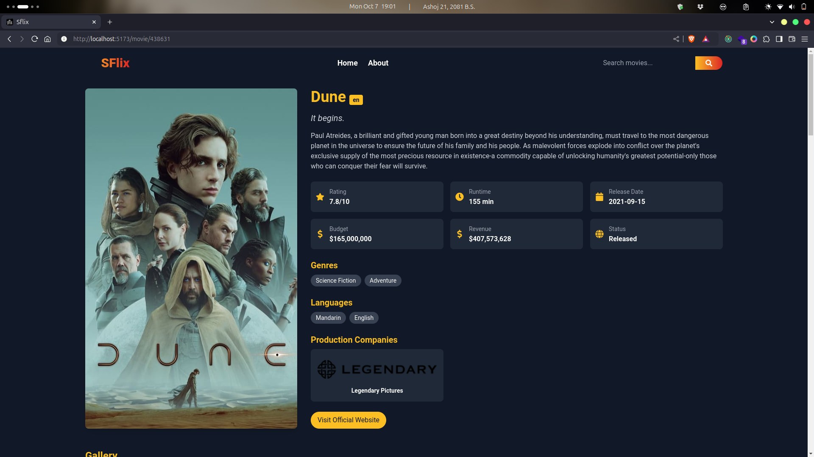

# SFlix - Your Ultimate Movie Hub

SFlix is a web application that allows users to discover trending, playing now, and upcoming movies. Powered by TMDB API, SFlix provides a seamless movie browsing experience with detailed information about each movie.

## Features

- **Trending Movies**: Explore the latest trending movies.
- **Playing Now**: Discover movies currently playing in theaters.
- **Upcoming Movies**: Stay ahead with upcoming movie releases.
- **Search Functionality**: Easily search for your favorite movies.
- **Detailed Movie Information**: Get comprehensive details about each movie including synopsis, release date, and ratings.

## Technologies Used

- React.js: Frontend framework for building user interfaces.
- Redux Toolkit: State management library for managing application state.
- Axios: HTTP client for making API calls.
- Tailwind CSS: Utility-first CSS framework for styling user interfaces.
- TMDB API: Provides access to a vast database of movies and TV shows.

## Setup Instructions

1. **Clone the repository**:

```bash
git clone https://github.com/f0rsakeN-afk/sflix.git
```

## Screenshots

**Home page**


exi**Movie search page**


## Contributing

Contributions are welcome! If you find any bugs or have suggestions for improvements, please feel free to open an issue or submit a pull request.
